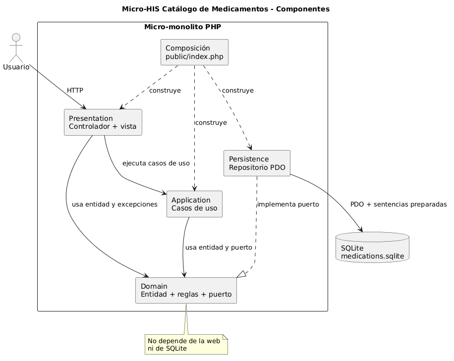

# Micro-HIS Catálogo de Medicamentos

## Portada textual

**Asignatura:** Análisis de Sistemas II  
**Asignación individual:** Micro-HIS Catálogo de Medicamentos  
**Módulo oficial:** Catálogo de medicamentos  
**Alcance:** Catálogo de medicamentos  
**Estudiante:** María Yamilet Lindo Pablo  
**Usuario de GitHub:** Yamilet1235  
**Tecnología:** PHP 8.2, SQLite y PDO  
**Tipo de solución:** Micro-monolito educativo  
**Fecha:** 12 de septiembre de 2026
**Docente:** Ing. Richard David Ortiz Sasvin

## Índice manual

1. Introducción
2. Consigna individual
3. Arquitectura
4. Explicación de las cuatro capas
5. Funcionalidades
6. Reglas del dominio
7. Decisiones técnicas
8. Persistencia y sentencias preparadas
9. Pruebas y evidencias
10. Limitaciones
11. Conclusión
12. Bibliografía

## 1. Introducción

Este trabajo presenta un Micro-HIS enfocado exclusivamente en un catálogo de medicamentos. Su propósito es demostrar, en una aplicación pequeña y ejecutable, la separación de responsabilidades, la aplicación de reglas de negocio y la persistencia segura con SQLite. Todos los registros incluidos son ficticios y no se procesa información clínica identificable.

La solución permite dar de alta medicamentos, buscarlos por su nombre comercial o nombre genérico y controlar su vigencia mediante los estados técnicos `ACTIVE` e `INACTIVE`. La interfaz traduce esos estados como `ACTIVO` e `INACTIVO` para que sean fáciles de comprender.

## 2. Consigna individual

La consigna consiste en desarrollar el módulo oficial **Catálogo de medicamentos** con PHP vanilla 8.2 o superior, sin frameworks. El producto debe ser un micro-monolito dividido en Presentation, Application, Domain y Persistence, con SQLite mediante PDO y sentencias preparadas.

El alcance funcional individual comprende:

- Alta de medicamentos.
- Listado del catálogo.
- Búsqueda por nombre o nombre genérico.
- Activación y desactivación.
- Mensajes de éxito y error.
- Reglas de obligatoriedad, estado, unicidad y vigencia.
- Pruebas automáticas ejecutables sin dependencias externas.

## 3. Arquitectura

Se eligió un micro-monolito porque todo el módulo se ejecuta como una sola aplicación y usa una sola base de datos, pero internamente está separado por responsabilidades. Esto reduce la complejidad operativa de un microservicio sin renunciar a límites claros en el código.

El punto de entrada `public/index.php` construye las dependencias. Presentation utiliza casos de uso de Application. Application trabaja contra el puerto `MedicationRepository`, declarado en Domain. Persistence implementa ese puerto mediante `PdoMedicationRepository`. Domain no depende de la web ni de SQLite.

Los diagramas editables están disponibles en:

- `docs/diagrama-componentes.puml`.
- `docs/diagrama-secuencia.puml`.
- `docs/diagrama-clases.puml`.

## 4. Explicación de las cuatro capas

### Presentation

Contiene `MedicationController` y la vista `catalog.php`. Su responsabilidad es interpretar solicitudes HTTP, recoger los datos de los formularios, mostrar mensajes y renderizar HTML. No decide si un medicamento está vigente ni valida duplicados.

### Application

Contiene los casos de uso `RegisterMedication`, `SearchMedications` y `ToggleMedicationStatus`. Coordina el flujo de cada operación y utiliza el repositorio a través de su interfaz. También transforma fallos del repositorio en mensajes de aplicación que Presentation puede mostrar.

### Domain

Es el centro del sistema. `Medication` comprueba los campos obligatorios y responde si el registro es vigente o seleccionable. `MedicationStatus` acepta solamente `ACTIVE` o `INACTIVE`. También se encuentran aquí la excepción de duplicado y el puerto `MedicationRepository`, porque expresan contratos y reglas requeridas por el negocio.

### Persistence

Contiene `DatabaseConnection` y `PdoMedicationRepository`. Abre la conexión SQLite, prepara consultas, convierte filas a entidades y captura `PDOException`. Esta capa conoce PDO, pero el resto del sistema trabaja con el puerto del dominio.

## 5. Funcionalidades

### Alta

El formulario solicita nombre comercial, nombre genérico, presentación, concentración y estado. Al enviar datos válidos se crea la entidad, se verifica la unicidad y se inserta el registro. Después se muestra una confirmación.

### Listado

La página principal presenta los registros ordenados por nombre. Cada fila muestra los datos básicos, el estado y una descripción explícita de la vigencia.

### Búsqueda

El cuadro de búsqueda consulta simultáneamente el nombre comercial normalizado y `generic_name`. Admite coincidencias parciales; el nombre comercial no distingue mayúsculas, incluidas las letras acentuadas habituales.

### Control de estado

Cada fila dispone de una acción para alternar entre `ACTIVE` e `INACTIVE`. Un registro `INACTIVE` se muestra visualmente atenuado y el dominio indica que no es vigente ni seleccionable.

### Mensajes

La interfaz diferencia confirmaciones de errores. Las excepciones técnicas de PDO no se presentan directamente al usuario.

## 6. Reglas del dominio

- El nombre es obligatorio.
- El nombre genérico es obligatorio.
- La presentación es obligatoria.
- La concentración es obligatoria.
- El estado solo puede ser `ACTIVE` o `INACTIVE`.
- No puede existir otro medicamento con el mismo nombre, ignorando mayúsculas y minúsculas.
- Un medicamento `INACTIVE` no está vigente.
- Un medicamento `INACTIVE` no es seleccionable.

Las reglas obligatorias y de vigencia están en `Medication` y `MedicationStatus`. La regla de duplicado se coordina en el caso de uso y se refuerza con una restricción SQLite para cubrir inserciones concurrentes o externas.

## 7. Decisiones técnicas

- **PHP vanilla:** hace visibles los límites arquitectónicos sin ocultarlos detrás de un framework.
- **Autocarga propia:** `src/bootstrap.php` carga las clases del espacio de nombres `MicroHis` sin Composer.
- **Enums:** `MedicationStatus` evita estados inválidos dentro del dominio.
- **Inyección por constructor:** los casos de uso reciben `MedicationRepository`; así pueden usar PDO en producción o un doble en pruebas.
- **Patrón Post/Redirect/Get:** después de una operación exitosa se redirige para evitar reenvíos involuntarios al actualizar el navegador.
- **Escapado HTML:** toda salida variable se procesa con `htmlspecialchars`.
- **Configuración externa:** la ruta de la base se define en `config/config.php`, ignorado por Git, con un ejemplo versionable.
- **Sin Composer:** no se necesita ninguna biblioteca externa para este alcance.

## 8. Persistencia y sentencias preparadas

La tabla `medications` almacena identificador, nombre, nombre genérico, presentación, concentración, estado y fecha de creación. SQLite aplica tres defensas:

- `NOT NULL` en todos los campos funcionales.
- Una clave interna `normalized_name` con `UNIQUE` para impedir duplicados por cambios de mayúsculas, incluidas las letras acentuadas habituales en español.
- `CHECK (status IN ('ACTIVE', 'INACTIVE'))` para limitar el estado.

PDO se configura con excepciones activadas, modo de recuperación asociativo y preparación emulada desactivada. El repositorio utiliza `prepare()` y `execute()` en inserciones, búsquedas, consultas y actualizaciones. El inicializador también prepara el esquema, la semilla y el conteo. Los valores no se concatenan en el SQL.

Cuando PDO falla, `PdoMedicationRepository` captura `PDOException`. Una violación de unicidad se transforma en `DuplicateMedicationException`; los demás fallos se convierten en `RepositoryException` con un mensaje controlado. Application finalmente traduce los errores de infraestructura para Presentation.

## 9. Pruebas y evidencias

El archivo `tests/run.php` implementa un ejecutor sencillo sin framework. Usa un repositorio en memoria, otro doble que siempre falla y una base SQLite temporal en memoria para probar PDO. El comando es:

```bash
php tests/run.php
```

Casos cubiertos:

1. Registro válido y asignación de identificador.
2. Rechazo de un campo obligatorio vacío.
3. Rechazo de un nombre duplicado con diferente combinación de mayúsculas.
4. Confirmación de que un medicamento inactivo no es vigente ni seleccionable.
5. Transformación de una excepción producida por un doble de persistencia.
6. Integración real de PDO y SQLite para alta, búsquedas, duplicado acentuado y cambio de estado.

### Evidencias de cumplimiento

La siguiente vista representa la arquitectura del Micro-HIS Catálogo de Medicamentos y muestra las capas Presentation, Application, Domain y Persistence, junto con sus dependencias.




#### Verificación técnica ejecutada

La verificación final se realizó localmente sobre PHP 8.2.12.

**Versión de PHP:**

```text
PHP 8.2.12 (cli)
```

**Inicialización de la base de datos:**

```text
Base de datos inicializada correctamente.
Medicamentos disponibles: 5
```

**Pruebas automáticas:**

```text
[APROBADA] Camino feliz: registra un medicamento válido
[APROBADA] Dominio: rechaza campos obligatorios vacíos
[APROBADA] Aplicación: rechaza duplicados con mayúsculas y acentos
[APROBADA] Vigencia: un medicamento inactivo no es vigente ni seleccionable
[APROBADA] Aplicación: transforma un error de persistencia
[APROBADA] Persistencia PDO: integra alta, búsqueda, unicidad y estado

Resultado: 6 aprobadas, 0 fallidas.
```

#### Evidencia verificable en el repositorio

- Alta de medicamentos: `src/Application/UseCase/RegisterMedication.php`.
- Búsqueda: `src/Application/UseCase/SearchMedications.php`.
- Activación y desactivación: `src/Application/UseCase/ToggleMedicationStatus.php`.
- Reglas del dominio: `src/Domain/Medication.php`.
- Puerto de persistencia: `src/Domain/Repository/MedicationRepository.php`.
- Persistencia PDO y sentencias preparadas: `src/Persistence/PdoMedicationRepository.php`.
- Conexión PDO: `src/Persistence/DatabaseConnection.php`.
- Presentación y control HTTP: `src/Presentation/MedicationController.php`.
- Pruebas automáticas: `tests/run.php`.
- Esquema SQLite: `database/schema.sql`.
- Vista arquitectónica UML: `docs/imagenes/diagrama-componentes.png`.
- Fuente editable del diagrama: `docs/diagrama-componentes.puml`.

La evidencia anterior utiliza únicamente datos ficticios y no contiene información clínica real.

### 10. Limitaciones

- Es un módulo educativo de un solo usuario y no incluye autenticación ni permisos.
- No incluye edición ni eliminación, porque están fuera del alcance solicitado.
- No gestiona inventario, lotes, fechas de vencimiento, recetas ni pacientes.
- SQLite es apropiado para una demostración local, pero no se evaluó para alta concurrencia.
- La interfaz no incluye paginación; el catálogo está pensado para pocos registros de práctica.
- La normalización sin la extensión opcional `mbstring` incluye las letras latinas acentuadas habituales; alfabetos no latinos podrían requerir una estrategia Unicode adicional.
- No se añadió protección CSRF; antes de un uso real con sesiones y usuarios sería necesaria.

## 11. Conclusión

Se logró construir un micro-monolito ejecutable para dar de alta, buscar, listar y controlar la vigencia de medicamentos ficticios. La decisión más relevante fue declarar el repositorio como un puerto del dominio e inyectarlo en los casos de uso, porque desacopla las reglas y operaciones de PDO y permite probar el comportamiento con dobles simples.

La principal limitación es que el módulo cubre solamente un catálogo académico local: no posee seguridad de usuarios, paginación ni procesos clínicos. El cumplimiento se evidencia mediante las seis pruebas automáticas, la inicialización reproducible de SQLite, la interfaz funcional y los diagramas editables que representan las cuatro capas.

## 12. Bibliografía

- PHP Documentation Group. *PHP Manual*. https://www.php.net/manual/es/ Consultado para sintaxis de PHP 8 y manejo de excepciones.
- PHP Documentation Group. *PDO - PHP Data Objects*. https://www.php.net/manual/es/book.pdo.php Consultado para conexión, sentencias preparadas y manejo de errores.
- PHP Documentation Group. *PDO::prepare*. https://www.php.net/manual/es/pdo.prepare.php Consultado para preparación y enlace de parámetros.
- Object Management Group. *OMG Unified Modeling Language (OMG UML), Version 2.5.1*. https://www.omg.org/spec/UML/2.5.1/PDF
