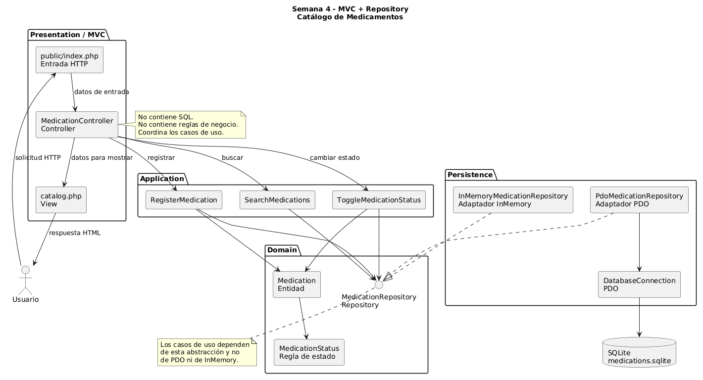
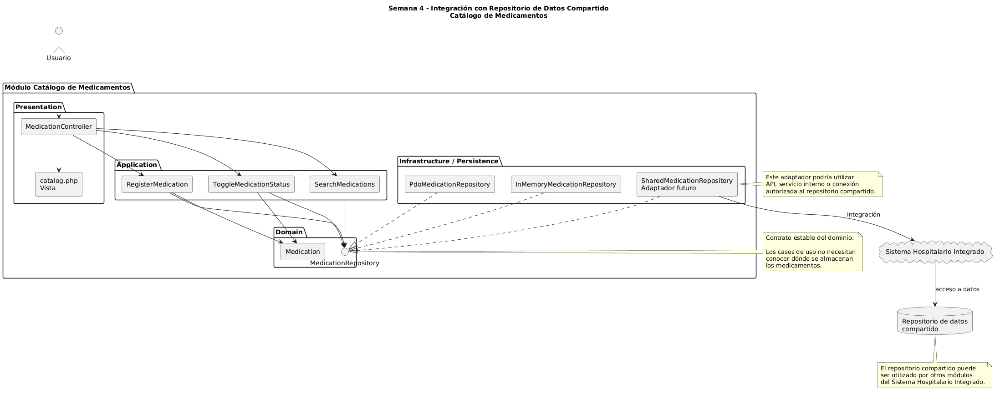

# Semana 4 — Arquitectura en capas y patrón Repository

## Micro-HIS Catálogo de Medicamentos

**Estudiante:** María Yamilet Lindo Pablo  
**Carné:** 1890-23-14827  
**Módulo:** Catálogo de medicamentos  
**Asignatura:** Análisis de Sistemas II  
**Semana:** 4  
**Tema:** Arquitectura en capas, MVC y patrón Repository  

---

## 1. Objetivo

Continuar el Micro-HIS Catálogo de Medicamentos desarrollado en la Semana 3, organizando sus responsabilidades mediante una arquitectura en capas, utilizando MVC en la entrada de la aplicación y aplicando el patrón Repository para desacoplar la lógica del sistema de la persistencia de datos.

El módulo mantiene las funcionalidades de:

- Registro de medicamentos.
- Búsqueda de medicamentos.
- Control de vigencia.
- Activación y desactivación.
- Validación de reglas del dominio.

---

## 2. Arquitectura utilizada

El Micro-HIS se encuentra dividido en las siguientes capas:

### Presentation

Responsable de recibir solicitudes del usuario y preparar la respuesta.

Componentes principales:

- `MedicationController.php`
- `views/catalog.php`
- `public/index.php`

El controlador no contiene sentencias SQL ni reglas de negocio.

### Application

Contiene los casos de uso del sistema.

Casos de uso principales:

- `RegisterMedication.php`
- `SearchMedications.php`
- `ToggleMedicationStatus.php`

Esta capa coordina las operaciones requeridas por el usuario y utiliza la abstracción `MedicationRepository`.

### Domain

Contiene las entidades, reglas y contratos principales del negocio.

Componentes principales:

- `Medication.php`
- `MedicationStatus.php`
- `MedicationNameNormalizer.php`
- `MedicationRepository.php`

La interfaz `MedicationRepository` define las operaciones que requiere la aplicación sin depender de una tecnología específica de almacenamiento.

### Persistence

Contiene las implementaciones concretas de persistencia.

Adaptadores implementados:

- `PdoMedicationRepository.php`
- `InMemoryMedicationRepository.php`
- `DatabaseConnection.php`

---

## 3. Aplicación de MVC

El patrón MVC se refleja de la siguiente forma:

### Model

El modelo está representado principalmente por el dominio y los casos de uso:

- `Medication`
- `MedicationStatus`
- `RegisterMedication`
- `SearchMedications`
- `ToggleMedicationStatus`

### View

La vista se encuentra en:

`src/Presentation/views/catalog.php`

Su responsabilidad es presentar la información al usuario.

### Controller

El controlador se encuentra en:

`src/Presentation/MedicationController.php`

Su responsabilidad es:

1. Recibir los datos de entrada.
2. Determinar la acción solicitada.
3. Invocar el caso de uso correspondiente.
4. Preparar la información que necesita la vista.

El controlador no ejecuta SQL directamente ni implementa reglas del dominio.

---

## 4. Patrón Repository

Se utiliza la interfaz:

`src/Domain/Repository/MedicationRepository.php`

Esta interfaz define las operaciones:

- `add`
- `findById`
- `findByName`
- `search`
- `changeStatus`

Los casos de uso dependen de esta interfaz y no de una base de datos específica.

Esto permite sustituir el mecanismo de almacenamiento sin modificar la lógica de aplicación.

---

## 5. Adaptador PDO

La implementación:

`src/Persistence/PdoMedicationRepository.php`

permite almacenar los medicamentos utilizando PDO y SQLite.

Entre sus responsabilidades se encuentran:

- Registrar medicamentos.
- Buscar medicamentos.
- Consultar medicamentos por identificador.
- Verificar nombres duplicados.
- Cambiar el estado de un medicamento.
- Ejecutar sentencias SQL preparadas.

Las sentencias SQL permanecen únicamente dentro de la capa de persistencia.

---

## 6. Adaptador InMemory

La implementación:

`src/Persistence/InMemoryMedicationRepository.php`

permite almacenar medicamentos temporalmente en memoria.

Este adaptador implementa exactamente el mismo contrato `MedicationRepository`.

Sus ventajas son:

- Facilita las pruebas.
- No necesita una base de datos.
- Permite sustituir PDO sin modificar los casos de uso.
- Demuestra el desacoplamiento proporcionado por Repository.

---

## 7. Objetos reutilizables

Los principales objetos reutilizables del módulo son:

| Objeto | Responsabilidad |
|---|---|
| `Medication` | Representar un medicamento y sus reglas |
| `MedicationStatus` | Representar el estado del medicamento |
| `MedicationRepository` | Definir el contrato de persistencia |
| `RegisterMedication` | Registrar medicamentos |
| `SearchMedications` | Buscar medicamentos |
| `ToggleMedicationStatus` | Cambiar la vigencia |
| `PdoMedicationRepository` | Persistencia real con PDO |
| `InMemoryMedicationRepository` | Persistencia temporal en memoria |
| `MedicationController` | Coordinar la entrada HTTP |

---

## 8. Flujo de dependencias

El flujo general es:

Usuario  
↓  
Vista / Entrada HTTP  
↓  
MedicationController  
↓  
Casos de uso de Application  
↓  
MedicationRepository  
↓  
PdoMedicationRepository o InMemoryMedicationRepository  

La capa de Application conoce únicamente el contrato `MedicationRepository`.

Esto permite cambiar el adaptador de persistencia sin modificar los casos de uso.

---
### Diagrama MVC y patrón Repository

El siguiente diagrama muestra la organización del módulo mediante MVC, las capas de la aplicación y los adaptadores PDO e InMemory que implementan el contrato `MedicationRepository`.




## 9. Repositorio de datos compartido

En una integración futura con el Sistema Hospitalario Integrado, el módulo podría consumir un repositorio de datos compartido.

La arquitectura propuesta sería:

Catálogo de Medicamentos  
↓  
Casos de uso  
↓  
MedicationRepository  
↓  
Adaptador de infraestructura  
↓  
Repositorio de datos compartido del Sistema Hospitalario

La interfaz `MedicationRepository` permanecería sin cambios.

Solamente sería necesario implementar un nuevo adaptador que permita comunicarse con el repositorio compartido.

De esta forma, el dominio y los casos de uso no dependerían directamente de la tecnología utilizada por el sistema hospitalario.


### Diagrama de integración con repositorio compartido

El siguiente diagrama representa cómo el módulo Catálogo de Medicamentos podría integrarse con un repositorio de datos compartido del Sistema Hospitalario Integrado sin modificar los casos de uso ni el dominio.




---

## 10. Verificación


Se verificó la sintaxis del nuevo adaptador:


```text
No syntax errors detected in
Semana-03-Micro-Monolito/src/Persistence/InMemoryMedicationRepository.php


También se ejecutaron las pruebas automáticas:

```text
[APROBADA] Camino feliz: registra un medicamento válido
[APROBADA] Dominio: rechaza campos obligatorios vacíos
[APROBADA] Aplicación: rechaza duplicados con mayúsculas y acentos
[APROBADA] Vigencia: un medicamento inactivo no es vigente ni seleccionable
[APROBADA] Aplicación: transforma un error de persistencia
[APROBADA] Persistencia PDO: integra alta, búsqueda, unicidad y estado

Resultado: 6 aprobadas, 0 fallidas.
```

---

## 11. Conclusión

La evolución realizada en la Semana 4 mantiene el mismo Micro-HIS desarrollado en la Semana 3 y fortalece su arquitectura mediante MVC y el patrón Repository.

La aplicación permanece desacoplada de la persistencia gracias a `MedicationRepository`, permitiendo utilizar tanto PDO como almacenamiento InMemory.

La separación de responsabilidades facilita las pruebas, el mantenimiento y una futura integración del Catálogo de Medicamentos con un repositorio de datos compartido del Sistema Hospitalario Integrado.


