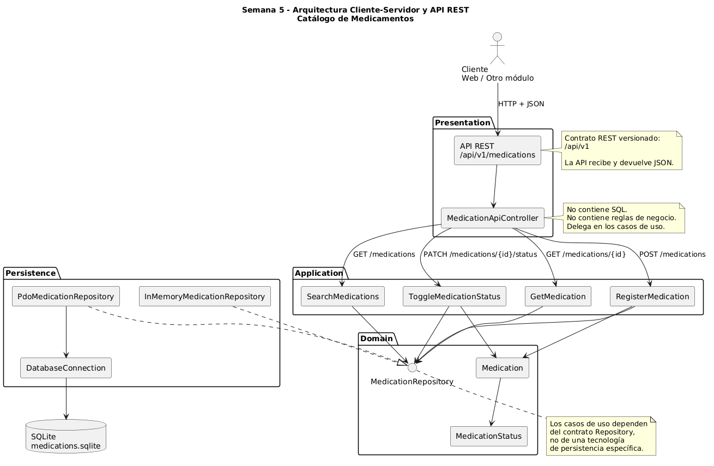
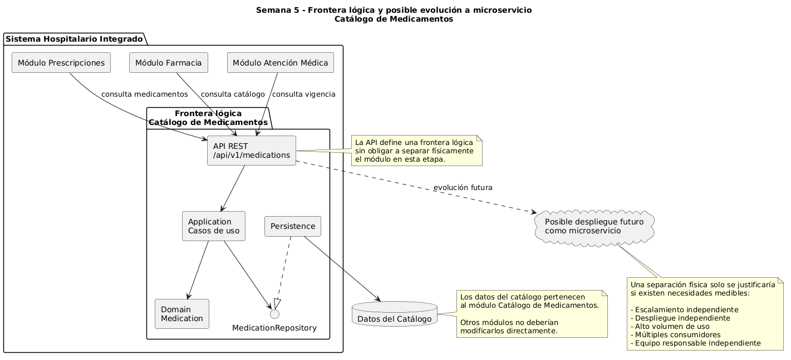

# Semana 5 — Cliente-servidor, API REST, microservicios e integración

## Micro-HIS Catálogo de Medicamentos

**Estudiante:** María Yamilet Lindo Pablo  
**Carné:** 1890-23-14827  
**Módulo:** Catálogo de medicamentos  
**Asignatura:** Análisis de Sistemas II  
**Semana:** 5  
**Issue:** #5  
**Rama:** `feature/semana-5-api-rest-microservicio`  
**Worktree:** `ASII-Semana-05-API-REST`

---

## 1. Objetivo

Evolucionar el mismo Micro-HIS Catálogo de Medicamentos desarrollado durante las semanas anteriores hacia un diseño cliente-servidor mediante una API REST.

También se analiza si el Catálogo de Medicamentos debe considerarse una frontera independiente de microservicio, sin dividir innecesariamente el sistema ni construir infraestructura de producción.

El flujo funcional continúa siendo:

- Alta de medicamentos.
- Consulta de medicamentos.
- Búsqueda de medicamentos.
- Control de vigencia.
- Activación y desactivación.

---

## 2. Arquitectura propuesta

El sistema mantiene la separación existente:

- Presentation
- Application
- Domain
- Persistence

La API REST se incorpora como una nueva forma de entrada dentro de la capa Presentation.

Flujo propuesto:

Cliente  
↓  
API REST  
↓  
Controller  
↓  
Casos de uso de Application  
↓  
MedicationRepository  
↓  
Adaptador de persistencia  
↓  
Base de datos

La API no debe contener reglas de negocio ni SQL.

### Diagrama cliente-servidor y API REST

El siguiente diagrama muestra el flujo desde el cliente hasta la persistencia mediante la API REST, reutilizando los casos de uso y el patrón Repository existente.




---

## 3. Versión de la API

Se propone utilizar versionado desde el inicio:

`/api/v1`

Esto permite evolucionar el contrato en el futuro sin romper inmediatamente clientes existentes.

---

## 4. Recurso principal

El recurso principal de la API es:

`medications`

Ruta base:

`/api/v1/medications`

---

# 5. Contrato API REST

## 5.1 Listar y buscar medicamentos

### Endpoint

`GET /api/v1/medications`

### Descripción

Obtiene el catálogo de medicamentos.

Puede utilizarse también para realizar búsquedas mediante parámetros de consulta.

### Parámetros opcionales

| Parámetro | Ejemplo | Descripción |
|---|---|---|
| `search` | `paracetamol` | Busca por nombre comercial o genérico |
| `status` | `ACTIVE` | Filtra por estado |

### Ejemplo

```http
GET /api/v1/medications?search=demo&status=ACTIVE
```

### Respuesta exitosa

**HTTP 200 OK**

```json
{
  "data": [
    {
      "id": 1,
      "name": "Medicamento Demo",
      "genericName": "Compuesto ficticio",
      "presentation": "Tabletas",
      "concentration": "500 mg",
      "status": "ACTIVE"
    }
  ]
}
```

---

## 5.2 Obtener detalle de un medicamento

### Endpoint

`GET /api/v1/medications/{id}`

### Ejemplo

```http
GET /api/v1/medications/1
```

### Respuesta exitosa

**HTTP 200 OK**

```json
{
  "data": {
    "id": 1,
    "name": "Medicamento Demo",
    "genericName": "Compuesto ficticio",
    "presentation": "Tabletas",
    "concentration": "500 mg",
    "status": "ACTIVE"
  }
}
```

### Medicamento inexistente

**HTTP 404 Not Found**

```json
{
  "error": {
    "code": "MEDICATION_NOT_FOUND",
    "message": "El medicamento solicitado no existe."
  }
}
```

---

## 5.3 Registrar medicamento

### Endpoint

`POST /api/v1/medications`

### Solicitud

```json
{
  "name": "Medicamento Demo",
  "genericName": "Compuesto ficticio",
  "presentation": "Tabletas",
  "concentration": "500 mg",
  "status": "ACTIVE"
}
```

### Respuesta exitosa

**HTTP 201 Created**

```json
{
  "data": {
    "id": 1,
    "name": "Medicamento Demo",
    "genericName": "Compuesto ficticio",
    "presentation": "Tabletas",
    "concentration": "500 mg",
    "status": "ACTIVE"
  }
}
```

### Datos inválidos

**HTTP 422 Unprocessable Entity**

```json
{
  "error": {
    "code": "VALIDATION_ERROR",
    "message": "Los datos enviados no son válidos."
  }
}
```

### Nombre duplicado

**HTTP 409 Conflict**

```json
{
  "error": {
    "code": "DUPLICATE_MEDICATION",
    "message": "Ya existe un medicamento con ese nombre."
  }
}
```

---

## 5.4 Cambiar vigencia del medicamento

### Endpoint

`PATCH /api/v1/medications/{id}/status`

### Solicitud

```json
{
  "status": "INACTIVE"
}
```

También puede recibirse:

```json
{
  "status": "ACTIVE"
}
```

### Respuesta exitosa

**HTTP 200 OK**

```json
{
  "data": {
    "id": 1,
    "status": "INACTIVE",
    "current": false,
    "selectable": false
  }
}
```

### Medicamento inexistente

**HTTP 404 Not Found**

```json
{
  "error": {
    "code": "MEDICATION_NOT_FOUND",
    "message": "El medicamento solicitado no existe."
  }
}
```

---

## 6. Códigos HTTP utilizados

| Código | Uso |
|---|---|
| `200` | Consulta o actualización exitosa |
| `201` | Medicamento creado |
| `400` | Solicitud mal formada |
| `404` | Medicamento no encontrado |
| `409` | Conflicto por duplicado |
| `422` | Error de validación |
| `500` | Error interno inesperado |

---

## 7. Propiedad de los datos

El módulo Catálogo de Medicamentos es responsable de los datos relacionados con:

- Nombre comercial.
- Nombre genérico.
- Presentación.
- Concentración.
- Estado.
- Vigencia.

Otros módulos del Sistema Hospitalario pueden consultar estos datos, pero no deberían modificar directamente las tablas del catálogo.

El acceso debe realizarse mediante el contrato definido por el módulo.

Esto disminuye el acoplamiento entre módulos.

---

## 8. Evaluación de frontera de microservicio

El Catálogo de Medicamentos puede considerarse una frontera funcional porque concentra:

- Gestión del catálogo.
- Validación de nombres.
- Presentaciones.
- Concentraciones.
- Estado.
- Reglas de vigencia.

Sin embargo, actualmente no existe evidencia suficiente que justifique desplegarlo como un microservicio independiente en producción.

Por ello se propone mantener el Micro-HIS como un sistema modular y definir una frontera lógica mediante API REST.

Esto permite preparar una futura separación sin introducir complejidad operativa 
innecesaria.

### Diagrama de frontera lógica del Catálogo de Medicamentos

El siguiente diagrama representa la frontera lógica del módulo Catálogo de Medicamentos, sus consumidores y una posible evolución futura hacia un microservicio independiente únicamente si existiera una justificación medible.




---

## 9. Criterios para una separación futura

La separación como microservicio podría evaluarse si aparecen condiciones como:

- Alto número de solicitudes independientes al catálogo.
- Necesidad de despliegue independiente.
- Uso del catálogo por múltiples sistemas.
- Necesidad de escalar el catálogo por separado.
- Equipos independientes responsables del módulo.
- Diferente ciclo de vida respecto al sistema hospitalario principal.

Sin evidencia medible de estas necesidades, se mantiene como módulo del sistema.

---

## 10. Comunicación

Se propone comunicación síncrona mediante:

```text
HTTP + JSON
```

Los consumidores utilizarían la API REST para consultar o modificar información autorizada.

Ejemplo:

```text
Módulo Prescripciones
        ↓
      HTTP
        ↓
Catálogo de Medicamentos
        ↓
MedicationRepository
        ↓
Persistencia
```

---

## 11. Seguridad

La API deberá considerar:

- HTTPS en producción.
- Autenticación mediante token.
- Autorización según rol.
- Validación de entradas.
- No exponer errores internos de base de datos.
- Registro de operaciones sensibles.

Ejemplo conceptual:

```http
Authorization: Bearer <token>
```

Las operaciones de modificación deberían limitarse a usuarios autorizados.

---

## 12. Resiliencia

En una futura integración distribuida se recomienda:

- Timeouts en llamadas HTTP.
- Manejo explícito de errores.
- Reintentos únicamente en operaciones seguras.
- Evitar reintentos infinitos.
- Respuestas consistentes ante fallos.
- Mantener el sistema funcional cuando una dependencia no crítica falle.

No se implementará infraestructura distribuida real en esta semana.

---

## 13. Observabilidad

Una futura API debería registrar:

- Método HTTP.
- Endpoint.
- Código de respuesta.
- Tiempo de respuesta.
- Identificador de solicitud.
- Errores controlados.

Ejemplo conceptual:

```text
request_id=abc123
method=POST
path=/api/v1/medications
status=201
duration_ms=32
```

Esto permitiría diagnosticar errores y medir el comportamiento del servicio.

---

## 14. Consistencia de datos

Las reglas importantes continúan ejecutándose dentro del módulo:

- Nombre obligatorio.
- Nombre único.
- Estado válido.
- Vigencia.
- Presentación.
- Concentración.

La API no debe duplicar estas reglas.

Debe delegar las operaciones hacia los casos de uso y el dominio existentes.

---

## 15. Migración razonada

La evolución propuesta se realizará gradualmente.

### Etapa 1 — Situación actual

Micro-HIS con interfaz web y arquitectura por capas.

### Etapa 2 — Contrato API

Definir rutas, solicitudes, respuestas y errores.

### Etapa 3 — Adaptador HTTP

Agregar controladores de API dentro de Presentation.

### Etapa 4 — Reutilización

Los controladores HTTP utilizan los mismos casos de uso existentes.

### Etapa 5 — Evaluación

Medir necesidades reales antes de decidir una separación física.

### Etapa 6 — Separación opcional

Solamente si existe justificación, trasladar la frontera lógica a un servicio desplegable de forma independiente.

De esta manera no se reescribe el dominio ni la lógica de aplicación.

---

## 16. Trazabilidad con semanas anteriores

| Semana | Evidencia reutilizada |
|---|---|
| Semana 1 | Actores, alcance y casos de uso |
| Semana 2 | RF/RNF, criterios de aceptación y SOLID |
| Semana 3 | Arquitectura en capas y Micro-HIS |
| Semana 4 | MVC, Repository, PDO e InMemory |
| Semana 5 | API REST y evaluación de frontera de microservicio |

---

## 17. Flujo Git de Semana 5

### Issue

`#5 - Semana 5: API REST y frontera de microservicio - Catálogo de Medicamentos`

### Rama

`feature/semana-5-api-rest-microservicio`

### Worktree

`ASII-Semana-05-API-REST`

### Destino del Pull Request

`main`

Flujo:

```text
Issue #5
   ↓
feature/semana-5-api-rest-microservicio
   ↓
Worktree ASII-Semana-05-API-REST
   ↓
Commits
   ↓
Pull Request
   ↓
main
```

---

## 18. Conclusión

La Semana 5 evoluciona el mismo Catálogo de Medicamentos hacia una arquitectura cliente-servidor mediante un contrato API REST.

La propuesta conserva las capas, reglas del dominio y patrón Repository implementados anteriormente.

Se define una frontera lógica para Catálogo de Medicamentos, pero no se propone todavía una separación física como microservicio debido a que no existe una necesidad medible que justifique la complejidad adicional.

La arquitectura queda preparada para evolucionar de forma gradual si futuras necesidades del Sistema Hospitalario Integrado lo requieren.